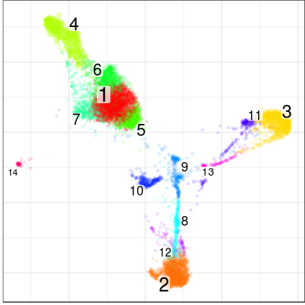
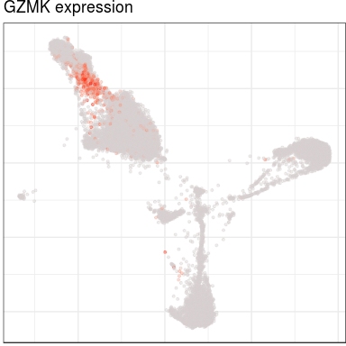
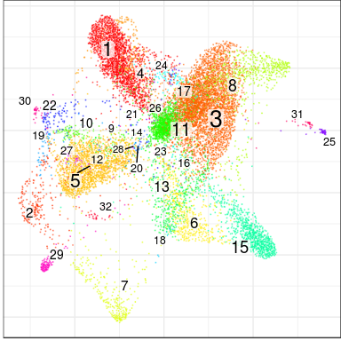
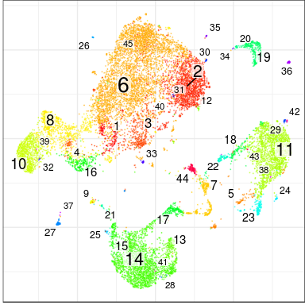

Conos Walkthrough
================

In this tutorial we will go over the analysis of a panel of samples using conos. Conos objects can be used to identify clusters of corresponding cells across panels of samples from similar or dissimilar sources, with different degrees of cell type overlap. Here we will identify corresponding clusters accorss a panel of bone marrow (BM) and cord blood (CB) by generating a joint graph with the cells from all the samples. We will use the graph to propagate labels from a single labelled sample to other samples and finally perform differential expression between BM and CM samples.

Preliminary
===========

Let's load conos library to start with:

``` r
library(conos)
```

    ## Loading required package: Matrix

    ## Loading required package: igraph

    ## 
    ## Attaching package: 'igraph'

    ## The following objects are masked from 'package:stats':
    ## 
    ##     decompose, spectrum

    ## The following object is masked from 'package:base':
    ## 
    ##     union

    ## Warning: replacing previous import 'heatmaply::normalize' by
    ## 'igraph::normalize' when loading 'conos'

    ## Warning: replacing previous import 'dendextend::%>%' by 'igraph::%>%' when
    ## loading 'conos'

    ## Warning: replacing previous import 'igraph::%>%' by 'dplyr::%>%' when
    ## loading 'conos'

Loading the data
================

Next we will load a previously prepared panel of samples. This panel was made up of 16 cord blood and bone marrow samples, but here we look at a smaller subset of just 4 samples. All samples have been subset to exactly 3000 cells. Note: when starting with your own panel, it's recommended to filter out low-count / poor /dying cells.

``` r
panel <- readRDS(file.path(find.package('conos'),'extdata','panel.rds'))
```

Let's take a look at the panel. The panel is a named list of sparse matrices (type dgCMatrix).

``` r
str(panel,1)
```

    ## List of 4
    ##  $ MantonBM1_HiSeq_1:Formal class 'dgCMatrix' [package "Matrix"] with 6 slots
    ##  $ MantonBM2_HiSeq_1:Formal class 'dgCMatrix' [package "Matrix"] with 6 slots
    ##  $ MantonCB1_HiSeq_1:Formal class 'dgCMatrix' [package "Matrix"] with 6 slots
    ##  $ MantonCB2_HiSeq_1:Formal class 'dgCMatrix' [package "Matrix"] with 6 slots

Before we continue it is very important to make sure that cells in our panel are uniquely named. No two cells (even in different samples) should be named identically. In this case the cells have been prefixed by sample id, so there will not be any collisions. However in most cases you will have to prefix the cells before continuing.

``` r
head(colnames(panel[[1]]))
```

    ## [1] "MantonBM1_HiSeq_1-TCTATTGGTCTCTCGT-1"
    ## [2] "MantonBM1_HiSeq_1-GAATAAGTCACGCATA-1"
    ## [3] "MantonBM1_HiSeq_1-ACACCGGTCTAACTTC-1"
    ## [4] "MantonBM1_HiSeq_1-TCATTTGGTACGCTGC-1"
    ## [5] "MantonBM1_HiSeq_1-TATTACCCAAAGGAAG-1"
    ## [6] "MantonBM1_HiSeq_1-CGCCAAGCATCTGGTA-1"

To quickly check that the cell names will be unique, we can run:

``` r
any(duplicated(unlist(lapply(panel,colnames))))
```

    ## [1] FALSE

Conos is focused on integration, and relies on [pagoda2](https://github.com/hms-dbmi/pagoda2) or [Seurat](https://satijalab.org/seurat/) to perform dataset pre-processing.

Pre-processing with Pagoda2
---------------------------

We will generate pagoda2 apps for poorly-expressed genes from each individual sample using `basicP2proc` helper function for quick processing. As the datasets will be compared to each other we will turn off automated dropping of low-expressed genes (`min.cells.per.gene=0`), and lower the numbers of local PCs estimated for faster processing. (note: you could run the outer loop in parallel using mclapply, however if ran within RStudio this sometimes causes multithreading problems):

``` r
require(pagoda2)
```

    ## Loading required package: pagoda2

    ## 

    ## Warning: replacing previous import 'igraph::%>%' by 'magrittr::%>%' when
    ## loading 'pagoda2'

    ## 
    ## Attaching package: 'pagoda2'

    ## The following objects are masked from 'package:conos':
    ## 
    ##     buildWijMatrix, projectKNNs

``` r
panel.preprocessed <- lapply(panel, basicP2proc, n.cores=4, min.cells.per.gene=0, n.odgenes=2e3, get.largevis=FALSE, make.geneknn=FALSE)
```

    ## 3000 cells, 18535 genes; normalizing ... using plain model winsorizing ... log scale ... done.
    ## calculating variance fit ... using gam 171 overdispersed genes ... 171 persisting ... done.
    ## running PCA using 2000 OD genes .... done
    ## running tSNE using 4 cores:
    ## 3000 cells, 17720 genes; normalizing ... using plain model winsorizing ... log scale ... done.
    ## calculating variance fit ... using gam 159 overdispersed genes ... 159 persisting ... done.
    ## running PCA using 2000 OD genes .... done
    ## running tSNE using 4 cores:
    ## 3000 cells, 18672 genes; normalizing ... using plain model winsorizing ... log scale ... done.
    ## calculating variance fit ... using gam 248 overdispersed genes ... 248 persisting ... done.
    ## running PCA using 2000 OD genes .... done
    ## running tSNE using 4 cores:
    ## 3000 cells, 17530 genes; normalizing ... using plain model winsorizing ... log scale ... done.
    ## calculating variance fit ... using gam 166 overdispersed genes ... 166 persisting ... done.
    ## running PCA using 2000 OD genes .... done
    ## running tSNE using 4 cores:

Let's look at the output of our processing. We now have a named list of pagoda2 objects, which is the starting point for the analysis with Conos.

``` r
str(panel.preprocessed,1)
```

    ## List of 4
    ##  $ MantonBM1_HiSeq_1:Reference class 'Pagoda2' [package "pagoda2"] with 16 fields
    ##   ..and 34 methods, of which 20 are  possibly relevant
    ##  $ MantonBM2_HiSeq_1:Reference class 'Pagoda2' [package "pagoda2"] with 16 fields
    ##   ..and 34 methods, of which 20 are  possibly relevant
    ##  $ MantonCB1_HiSeq_1:Reference class 'Pagoda2' [package "pagoda2"] with 16 fields
    ##   ..and 34 methods, of which 20 are  possibly relevant
    ##  $ MantonCB2_HiSeq_1:Reference class 'Pagoda2' [package "pagoda2"] with 16 fields
    ##   ..and 34 methods, of which 20 are  possibly relevant

Pre-processing with Seurat
--------------------------

The alternative, Seurat, pre-processing can be done in a similar way using an analogous `basicSeuratProc` helper function. Alternatively, if you already have a set of Seurat objects (one per dataset), you can just skip this step and feed them directly to `Conos$new()` as shown below.

``` r
require(Seurat)
panel.preprocessed <- lapply(panel, basicSeuratProc)
```

Integrating datasets with Conos
===============================

We will now construct a Conos object for this panel of samples. At this point we haven't calculated anything. We have just generated an object that contains the samples. Note that at this step we also set the n.cores parameter. The graph generation with Conos can take advantage of parallel processing, so use as many physical cores as you have available here.

``` r
con <- Conos$new(panel.preprocessed, n.cores=4)
```

Our original pagoda2 (or Seurat) objects are now saved in the conos object (if you are short of memory you can go ahead and delete the originals).

``` r
str(con$samples,1)
```

    ## List of 4
    ##  $ MantonBM1_HiSeq_1:Reference class 'Pagoda2' [package "pagoda2"] with 16 fields
    ##   ..and 34 methods, of which 20 are  possibly relevant
    ##  $ MantonBM2_HiSeq_1:Reference class 'Pagoda2' [package "pagoda2"] with 16 fields
    ##   ..and 34 methods, of which 20 are  possibly relevant
    ##  $ MantonCB1_HiSeq_1:Reference class 'Pagoda2' [package "pagoda2"] with 16 fields
    ##   ..and 34 methods, of which 20 are  possibly relevant
    ##  $ MantonCB2_HiSeq_1:Reference class 'Pagoda2' [package "pagoda2"] with 16 fields
    ##   ..and 34 methods, of which 20 are  possibly relevant

We can now plot a panel of these samples using the clusters we identified by examining each sample on its own. We note that each sample has an independent set of clusters that bears no relationship to clusters in other sample (for example note cluster 9).

``` r
con$plotPanel(clustering="multilevel", use.local.clusters=T, title.size=6)
```


Next we will build the joint graph that emcompasses all the samples. We do that by pairwise projecting samples onto a common space and establishing kNN of mNN pairs between the samples. We then append iwthin sample kNN neighbours to the graph to ensure that all the cell are included in the graph. We will use 'PCA' space here, which is faster than the default 'CPCA' space, and in most cases gives reasonable results. If your datasets were all measured on the same platform you may also want to consider "genes" space which can give better resolution in such (simpler) cases. Other parameters passed to the `buildGraph()` function below are all default values - so are shown just for information.

``` r
con$buildGraph(k=15, k.self=10, k.self.weight=0.1, space='PCA', ncomps=50, n.odgenes=2000, matching.method='mNN', metric='angular', verbose=TRUE)
```

    ## found 0 out of 6 cached PCA  space pairs ... running 6 additional PCA  space pairs  done
    ## inter-sample links using  mNN   done
    ## local pairs  done

Note: as pairwise comparisons may take a while, Conos will cache results for each space. If you want to recalculate, for instance PCA, pairings with different set of parameters (e.g. more components, different number of starting overdispersed genes), clear the cache first by doing `con$pairs$PCA <- NULL`.

We next use the graph we identified to get global clusters. Here we use mutlievel to obtain clusters.

``` r
con$findCommunities(method=multilevel.community, min.group.size=0)
```

We can now plot the clusters we obtained. Note that the cluster numbers between different samples now correspond to the same cell type. Also not the presence of cluster 5 in BM samples only, but not in CB.

``` r
con$plotPanel(font.size=4)
```


Check an expression pattern of a specific gene across all the individual embeddings.

``` r
con$plotPanel(gene = 'GZMK')
```


Next we embed and visualize the complete joint graph: note: embedding estimation will run the first time around. Please see `$embedGraph()` function for additional embedding options.

``` r
con$plotGraph()
```

    ## Estimating embeddings.


We note that the graph captures the population structure irrespecively of the sample of origin of each cell.

``` r
con$plotGraph(color.by='sample',mark.groups=F,alpha=0.1,show.legend=T)
```


We can also visualize gene expression on this joint graph embedding:

``` r
con$plotGraph(gene='GZMK',title='GZMK expression')
```



Other community detection methods can provide a more sensitive and hierarchical view of the subpopulation structure. Here we run walktrap community detection method on the same joint graph:

``` r
con$findCommunities(method = igraph::walktrap.community, steps=4)
```

Note: different clustering results are kept as a simple list under `con$clusters`.

Visualize new clusters:

``` r
con$plotPanel(clustering='walktrap',font.size=4)
```



New clustering, as viewed on a joint graph:

``` r
con$plotGraph(clustering='walktrap')
```


Exploring hierarchical community structure
==========================================

Walktrap clustering generates a hierarchical community structure. It also allows to visualize tissue or

``` r
conosShinyApp(con,N=30)
```

Label propagation
=================

One of the uses of this graph is to propagate labels. For example in some cases we will only have information about the cell types in one of the samples and we want to automatically label the other samples. We'll load annotation from a simple text file (first column giving cell name, second - cell type), and make a named factor out of it:

``` r
cellannot <- read.table(file.path(find.package('conos'),'extdata','cellannot.txt'),header=F)
cellannot <- setNames(cellannot[,2],cellannot[,1])
```

Next we plot our panel with the annotations we made. This is to verify that the annotated cells are indeed in only one sample and that the other samples are unlabelled.

``` r
con$plotPanel(groups = cellannot)
```



Next let's propagaes the labels from the one annotated sample to the other samples.

``` r
new.label.probabilities <- con$propagateLabels(labels = cellannot,verbose = T)
```

This function returns probabilites of the cell belonging to each group, we can assign each cell to the the the cell type with the highest probability.

``` r
new.annot <- setNames(colnames(new.label.probabilities)[apply(new.label.probabilities,1,which.max)], rownames(new.label.probabilities))
head(new.annot)
```

    ## MantonBM1_HiSeq_1-AGGGATGCAGGTGCCT-1 MantonBM2_HiSeq_1-CTGATAGAGCGTTCCG-1 
    ##                              "Tcyto"                              "Tcyto" 
    ## MantonBM1_HiSeq_1-GAGGTGATCATTTGGG-1 MantonBM1_HiSeq_1-CGAGCCAAGAAGGGTA-1 
    ##                              "Tcyto"                              "Tcyto" 
    ## MantonBM1_HiSeq_1-GTAACTGCAGATCCAT-1 MantonBM1_HiSeq_1-GACCAATTCAACACAC-1 
    ##                              "Tcyto"                              "Tcyto"

We not see that all our samples have been labelled automagically!

``` r
con$plotPanel(groups = new.annot)
```



Differential expression
=======================

Once we have identified a joint clustering of cells that captures cell relationships between samples, we want to ask what is different between the cells of these populations between specific samples types, in this case CB and BM samples. Conos provides routines to be able to do that.

First we need to define our sample groups

``` r
samplegroups <- list(
  bm = c("MantonBM1_HiSeq_1","MantonBM2_HiSeq_1"),
  cb = c("MantonCB1_HiSeq_1","MantonCB2_HiSeq_1")
)
```

We can then run differential expression between cells in these groups

``` r
de.multilevel <- getPerCellTypeDE(con, groups=as.factor(new.annot),sample.groups = samplegroups, ref.level='bm', n.cores=4)
```

...and examine the output

``` r
str(de.multilevel[1:3], 2)
```

    ## List of 3
    ##  $ Bcells:List of 3
    ##   ..$ res          :'data.frame':    15032 obs. of  6 variables:
    ##   ..$ cm           :Formal class 'dgCMatrix' [package "Matrix"] with 6 slots
    ##   ..$ sample.groups:List of 2
    ##  $ Mono  :List of 3
    ##   ..$ res          :'data.frame':    15032 obs. of  6 variables:
    ##   ..$ cm           :Formal class 'dgCMatrix' [package "Matrix"] with 6 slots
    ##   ..$ sample.groups:List of 2
    ##  $ Tcyto :List of 3
    ##   ..$ res          :'data.frame':    15032 obs. of  6 variables:
    ##   ..$ cm           :Formal class 'dgCMatrix' [package "Matrix"] with 6 slots
    ##   ..$ sample.groups:List of 2

Let's look at the results for the Bcells

``` r
res <- de.multilevel[['Bcells']]$res
head(res[order(res$padj,decreasing = FALSE),])
```

    ##                baseMean log2FoldChange     lfcSE       stat       pvalue
    ## IGHA1         1988.6809      -9.721541 0.7002776 -13.882411 8.097357e-44
    ## IGKC          8634.0787      -4.029124 0.4951806  -8.136676 4.062775e-16
    ## IGHG1          293.8465      -9.831735 1.4256675  -6.896233 5.339965e-12
    ## RP11-386I14.4  469.0104       2.672992 0.4015934   6.655966 2.814446e-11
    ## JCHAIN         916.4606      -4.187943 0.6414906  -6.528457 6.645071e-11
    ## CD69           573.3816       2.408595 0.4055050   5.939742 2.854706e-09
    ##                       padj
    ## IGHA1         1.199704e-39
    ## IGKC          3.009704e-12
    ## IGHG1         2.637231e-08
    ## RP11-386I14.4 1.042471e-07
    ## JCHAIN        1.969067e-07
    ## CD69          7.049220e-06

With correction
---------------

In certain cases we observe that differential expression will result in the similar genes between multiple cell types. This may be due to genuine biological reasons (similar response), due to background, or due to other effects. Conos can calculate a mean expression vector between the two conditions and subtract this from all the comparisons, so observer the cell-type specific effect.

``` r
fc.correction <- getCorrectionVector(con, groups=as.factor(new.annot),sample.groups = samplegroups, ref.level='bm', n.cores=4,correction.method='varianceweighted')
fc.correction[is.na(fc.correction)] <- 0

## Use corrected version
de.multilevel.corrected <- getPerCellTypeDECorrected(con, groups=as.factor(new.annot),sample.groups = samplegroups, ref.level='bm', n.cores=4, correction = fc.correction)
```

``` r
res <- as.data.frame(de.multilevel.corrected[['Mono']]$res)
head(res[order(res$padj,decreasing = FALSE),])
```

    ##         baseMean log2FoldChange     lfcSE      stat       pvalue
    ## IGLC2 3525.05605      -3.869276 0.5481036 -7.059387 1.672384e-12
    ## HBG2  3054.79282      13.903245 2.1882380  6.353626 2.102984e-10
    ## IGHG1  134.08108      -7.790745 1.4873106 -5.238142 1.622011e-07
    ## KCNH2   25.03435      -4.064320 1.0897455 -3.729605 1.917803e-04
    ## HBG1   474.99775      12.528324 3.4989321  3.580614 3.427883e-04
    ## ACRBP   25.50719       3.212743 0.8901956  3.609031 3.073434e-04
    ##               padj
    ## IGLC2 2.481650e-08
    ## HBG2  1.560309e-06
    ## IGHG1 8.023008e-04
    ## KCNH2 7.114570e-01
    ## HBG1  8.477726e-01
    ## ACRBP 8.477726e-01
